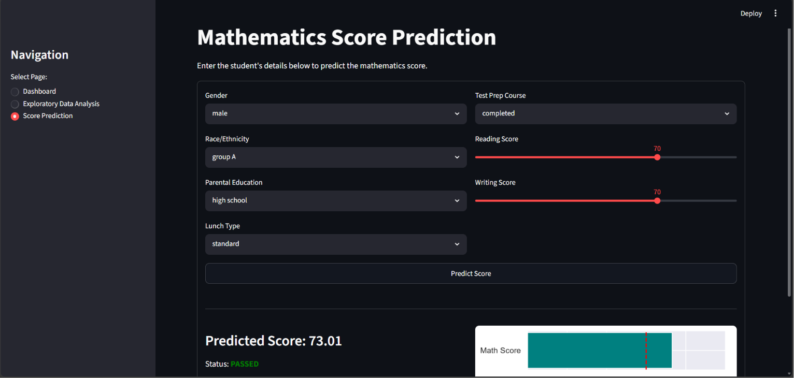

# 🎓 EduScore Analytics

### A Streamlit-Based Interactive Dashboard for Student Performance Analysis, Visualization, and Prediction.

EduScore Analytics is a Machine Learning-based web application designed to analyze student examination data, visualize performance trends, and predict mathematics scores through an interactive Streamlit dashboard. The project helps identify patterns in student performance and provides meaningful insights using data analysis and predictive modeling techniques.

---

## 📌 Project Overview

The objective of this project is to analyze student examination data and predict academic performance using Machine Learning algorithms. The application provides interactive visualizations, statistical insights, and predictive models to support better understanding of student performance.

---

## ✨ Key Features

- 📊 Interactive Streamlit Dashboard
- 📈 Student Performance Analysis
- 📉 Data Visualization
- 🧹 Data Cleaning & Preprocessing
- 🔄 Label Encoding & Feature Engineering
- 📋 Dataset Preview
- 🔍 Correlation Analysis
- 🤖 Mathematics Score Prediction
- 🎯 Pass/Fail Classification
- 📊 Performance Insights

---

## 🛠️ Technologies Used

| Technology | Purpose |
|------------|---------|
| Python | Core Programming Language |
| Streamlit | Interactive Web Application |
| Pandas | Data Manipulation & Analysis |
| NumPy | Numerical Computation |
| Matplotlib | Data Visualization |
| Seaborn | Statistical Visualization |
| Scikit-learn | Machine Learning Models |
| Joblib | Model Serialization |

---

## 📂 Dataset Information

The project uses the **exams.csv** dataset containing student examination records.

### Dataset Features

- Gender
- Race/Ethnicity
- Parental Level of Education
- Lunch Type
- Test Preparation Course
- Mathematics Score
- Reading Score
- Writing Score

---

## 🤖 Machine Learning Models

### Random Forest Classifier
Used for:
- Student Performance Classification
- Pass/Fail Prediction

### Linear Regression
Used for:
- Mathematics Score Prediction

---

## 📈 Dashboard Modules

- Dashboard Overview
- Dataset Preview
- Performance Visualization
- Correlation Analysis
- Student Performance Prediction
- Performance Insights

---

## 📁 Project Structure

```text
EduScore-Analytics/
│
├── app.py
├── EduScore Analyticss.py
├── exams.csv
├── model.pkl
├── requirements.txt
├── README.md
├── dashboard.png
└── assets/
```

---

## 🚀 Installation

### Clone Repository

```bash
git clone https://github.com/your-username/EduScore-Analytics.git
```

### Navigate to Project Folder

```bash
cd EduScore-Analytics
```

### Install Required Libraries

```bash
pip install -r requirements.txt
```

### Run the Application

```bash
streamlit run app.py
```

---

## 📸 Project Preview



---

## 🎯 Future Enhancements

- CSV File Upload
- PDF Report Generation
- Prediction History
- Enhanced Dashboard
- Advanced Performance Analytics

---

## 👨‍💻 Developed By

**Lakshya Garg**

B.Tech Student🎓

Computer Science & Engineering
Specialization in Artificial Intelligence(AI)👨‍💻

---

## 📄 License

This project is developed for educational and learning purposes only.